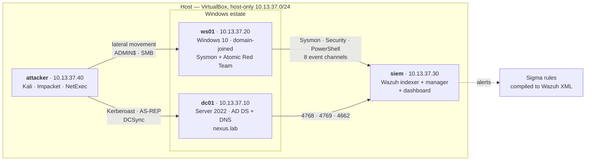

# detection-lab-as-code

**A reproducible Active Directory attack lab, and a Sigma rule set that is unit-tested on every commit.**

[](https://github.com/USERNAME/detection-lab-as-code/actions/workflows/detections-ci.yml)


---

## Why this exists

Most detection labs stop at "I installed a SIEM and ran some attacks." The rules
that come out of them have never been proven to fire, and — more importantly —
have never been proven to *stay quiet*. A rule that alerts on every PowerShell
process is not a detection; it is a denial-of-service attack against the analyst
reading the queue.

This repository takes the opposite position: **a detection is not finished until
it has been tested against both the attack and its benign look-alike.**

Concretely, that means:

| | |
|---|---|
| The lab is **code** | `vagrant up` builds a domain controller, a workstation, a SIEM and an attacker box. No manual clicking, no undocumented state. |
| Telemetry is **deliberate** | Every audit subcategory and Sysmon event enabled here exists because a named rule depends on it. The mapping is in the provisioning comments. |
| Rules are **tested** | Each rule ships with sample events. CI asserts it fires on the attack and does not fire on benign activity. Untested rules fail the build. |
| Coverage is **measured** | ATT&CK coverage is generated from the rules themselves, and gaps are reported by name rather than quietly omitted. |
| The AD is **realistic** | Five documented, intentional misconfigurations create reachable attack paths, plus background noise so rules face real false-positive pressure. |

---

## Current state

```
 rules      : 10   passed 10   failed 0   skipped 0
 detection  : 28/28 true positives fired
 precision  : 42/42 benign events correctly ignored
```

10 rules across 13 ATT&CK techniques and 6 tactics. Every one is validated on
every push. Tactics with no coverage yet are listed explicitly by
`tools/attack_coverage.py` — see [Known gaps](#known-gaps).

---

## Architecture



**Profiles** — pick one to fit your RAM, in `lab.yml`:

| Profile | Machines | RAM |
|---|---|---|
| `minimal` | siem + ws01 | ~12 GB |
| `standard` *(default)* | siem + dc01 + ws01 | ~15 GB |
| `full` | + attacker | ~17 GB |

---

## Quick start

**Prerequisites:** VirtualBox 7.x, Vagrant 2.4+, Python 3.10+, ~20 GB RAM, 60 GB disk.

```powershell
# 1. Host prerequisites (installs Vagrant + the reload plugin if missing)
.\bootstrap\install-prerequisites.ps1

# 2. Validate the rule set — no VMs needed, runs in seconds
pip install -r requirements.txt
python tools\validate_sigma.py

# 3. Build the lab (60-90 minutes on first run, mostly box downloads)
$env:LAB_PROFILE = "standard"
vagrant up siem      # bring the SIEM up first, so agents have somewhere to enrol
vagrant up dc01
vagrant up ws01

# 4. Dashboard
#    https://10.13.37.30   user: admin
vagrant ssh siem -c "sudo cat /root/wazuh-credentials.txt"
```

**Run an attack and score the coverage:**

```powershell
# on ws01 (the runner refuses to execute outside the lab subnet)
.\attack\run-atomic.ps1 -Scenario 01-domain-compromise -WhatIf   # dry run first
.\attack\run-atomic.ps1 -Scenario 01-domain-compromise

# back on the host, once the SIEM has ingested
python tools\attack_coverage.py --run 01-domain-compromise-20260814-113000
```

---

## The detection engineering workflow

This is the loop the repository is built around.

```
  1. hypothesis      "Kerberoasting is reachable in this domain"
        ↓
  2. attack          attack/scenarios/ — run the technique, generate real telemetry
        ↓
  3. observe         find the events in the SIEM; confirm the telemetry exists
        ↓                  ↳ if it does not, fix provision/windows/02-audit-policy.ps1
  4. write           detections/sigma/ — a rule keyed on invariants, not tool names
        ↓
  5. TEST            detections/tests/ — the attack event AND the benign look-alike
        ↓
  6. CI              python tools/validate_sigma.py — fires? stays silent? merge.
        ↓
  7. deploy          tools/sigma_to_wazuh.py — into the live SIEM
        ↓
  8. measure         tools/attack_coverage.py — what is still uncovered?
        └──────────────────────────────► back to 1
```

**Step 5 is the one that distinguishes this repo.** Writing a rule that fires is
easy. Writing one that fires *and* ignores the SCCM agent doing the same thing
is the actual job.

---

## Design decisions

Choices that were made deliberately, and would be reasonable to challenge:

**Rules key on invariants, not indicators.** The LSASS rule matches the memory
access mask required by the Windows API, not the string `mimikatz`. Renaming the
binary, recompiling it, or writing a brand new tool does not evade it, because
the access rights are dictated by the operating system rather than by the
attacker.

**Windows Defender stays enabled.** A lab with AV switched off teaches you to
detect attacks that would never survive first contact in production. Only the
Atomic Red Team staging directory is excluded, and Defender's own detections
become an extra telemetry source.

**The workstation is made to look lived-in.** `21-ws-victimise.ps1` creates
documents, benign scheduled tasks, benign Run-key entries and a recurring noise
generator. On a pristine VM every event looks anomalous, and rules tuned against
that silence fall apart on contact with a real network.

**The evaluator is written here rather than imported.** `tools/sigma_eval.py`
implements Sigma's condition grammar and field modifiers directly, including
`base64offset` and the UTF-16LE transform PowerShell's `-EncodedCommand` uses.
This keeps CI free of a backend whose output format can change between releases,
and the supported subset is documented rather than implied — unsupported
features raise rather than silently passing.

**The Wazuh converter reports what it cannot translate.** One of the ten rules
uses base64 transforms that native Wazuh rules cannot express. The converter
names it and exits non-zero. A converter that silently skipped it would produce
a SIEM that looks configured and is missing a detection nobody knows about.

---

## Repository layout

```
lab.yml                     single source of truth — sizes, IPs, telemetry, CI policy
Vagrantfile                 reads lab.yml; contains no hard-coded values

provision/windows/          01 base · 02 audit policy · 03 Sysmon
                            10-11 DC promote + populate · 20-21 join + victimise
                            30 Wazuh agent · 40 Atomic Red Team
provision/linux/siem/       Wazuh all-in-one install + rule deployment
provision/linux/attacker/   Impacket, NetExec, Kerberos client

detections/sigma/           the rules
detections/tests/           TP/FP sample events, one file per rule

attack/run-atomic.ps1       scenario runner with a lab-network safety interlock
attack/scenarios/           ordered intrusion chains, each stage naming its detection

tools/sigma_eval.py         Sigma condition evaluator
tools/validate_sigma.py     the quality gate — metadata policy + behaviour tests
tools/sigma_to_wazuh.py     Sigma → native Wazuh rules
tools/attack_coverage.py    ATT&CK coverage report + Navigator layer

docs/architecture.md        how the pieces fit, and why
docs/runbook.md             operating the lab, and what breaks
docs/writeups/              one writeup per detection
```

---

## Known gaps

Stated rather than hidden, because a coverage report that only lists successes
is marketing.

- **No coverage yet** for reconnaissance, resource-development, initial-access,
  privilege-escalation, discovery, collection, exfiltration, impact.
- **Discovery is the priority next rule** — scenario 01 executes T1087.002,
  T1482 and T1069.002 and nothing catches them.
- **No correlation rules.** Brute-force-then-success and beaconing need
  aggregation over a time window, which the in-process evaluator does not
  implement. Rules requiring it are marked `correlation: true` and are skipped
  *explicitly* by CI rather than silently passing.
- **The lab is single-DC and single-workstation.** Detections that depend on
  comparing behaviour across a fleet cannot be developed here.
- **Windows box images are evaluation licences** (180 days). Rebuild resets them.

---

## Extending it

Adding a detection is four files and one command:

```powershell
# 1. detections/sigma/windows/win_your_rule.yml
# 2. detections/tests/win_your_rule.test.yml   (>=1 TP and >=1 FP — enforced)
python tools\validate_sigma.py --rule win_your_rule -v
```

The metadata contract CI enforces lives in `lab.yml` under `detection_policy`.
Every rule needs a UUID, an author, an ATT&CK technique tag, references, and a
`falsepositives` list that names a real scenario — `Unknown` is rejected.

---

## License

MIT — see [LICENSE](LICENSE).

Built by **Wael Qumayi**. The attack tooling here is standard, publicly
documented software used against a disposable host-only lab that has no route to
any real network.
